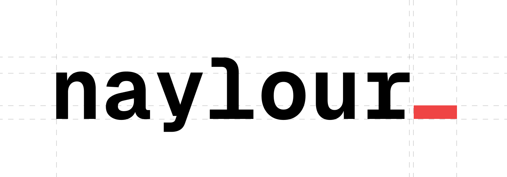

 

  

---

## About

Student developer with hands-on experience across the full stack — from low-level systems programming to frontend UIs, backend APIs, and CI/CD pipelines. Currently building this space as my personal blog and portfolio.

- Exploring **systems programming** with Rust, Zig, and C
- Building **web apps** with TypeScript and modern frameworks
- Interested in **compilers, OS internals, and developer tooling**
- This repo is a work-in-progress personal site / blog

## Stack

**Languages**

<!---->

**Web**

**Data**

**Tooling**

## GitHub Stats

